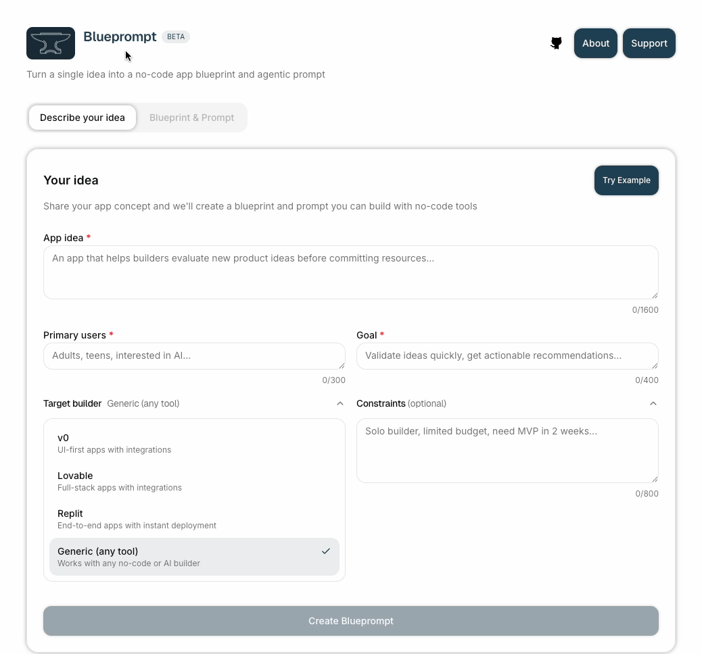

<p align="center">
  
</p>

# Blueprompt

**Turn a single idea into a no-code app blueprint and agentic prompt.**

Share your app concept and we'll create a blueprint and prompt you can build with no-code tools. Paste into v0, Lovable, or Replit to kick-start your build.

<p align="center">
  
</p>

## The Problem

No-code AI builders (v0, Lovable, Replit) work best with detailed, structured prompts. But most people have ideas, not specifications. The result? Vague prompts lead to generic outputs that miss the mark.

## The Solution

Blueprompt takes your idea and creates:

- **Full Blueprompt** — Complete product specification with screens, flows, data models, and agent design
- **App-Only Prompt** — Condensed, builder-ready prompt optimized for v0/Lovable/Replit
- **Agent-Only Prompt** — Standalone system prompt for AI agent configuration

## How It Works

1. **Describe your idea** — App concept, target users, goals, and constraints
2. **Select your builder** — v0, Lovable, Replit, or Generic
3. **Create Blueprompt** — Get a structured blueprint tailored to your chosen tool
4. **Copy & Paste** — Drop it into your no-code builder and start building

## Features

- **Streaming output** — Watch your blueprint being created in real-time
- **Builder-specific optimization** — Output tailored for v0, Lovable, Replit, or generic use
- **Three output formats** — Full spec, app-only, or agent-only prompts
- **One-click copy** — Copy any section instantly
- **Download options** — Save prompts as text files
- **Try Example** — See a complete example to understand the output format

## What You Get

### Full Blueprompt
A complete product specification including:
- Core concept and value proposition
- User personas and needs
- User flows and journeys
- Screen-by-screen specifications
- Data model (entities and fields)
- Agent design (persona, scope, rules, guardrails)
- Implementation notes for your target builder

### App-Only Prompt
A condensed, imperative prompt ready to paste into your builder:
- Direct instructions for the AI
- Screen layouts and components
- Key interactions and states
- Technical constraints

### Agent-Only Prompt
A standalone system prompt for AI agents:
- Agent persona and personality
- Scope and boundaries
- Communication style
- Rules and guardrails
- Input/output specifications

## Use with Claude Code

Run Blueprompt directly from your terminal as a Claude Code slash command. Create structured app blueprints and agent prompts without leaving your workflow.

### Installation

```bash
# Install globally (available in all projects)
curl -o ~/.claude/commands/blueprompt.md https://blueprompt.app/blueprompt.md

# Or install per-project
mkdir -p .claude/commands && curl -o .claude/commands/blueprompt.md https://blueprompt.app/blueprompt.md
```

> **Download full instructions:** [blueprompt-instructions.md](https://blueprompt.app/blueprompt-instructions.md)

### Usage

```
/blueprompt
```

Then describe your idea:

```
What: A habit tracking app for developers

Who: Solo developers, bootcamp grads

Goal: Build daily coding habits with streaks and reminders

Constraints: MVP only, no backend yet

Target: v0
```

### What It Creates

Blueprompt generates three outputs tailored to your target builder:

1. **Full Blueprompt** — Detailed specs with core concept, user flows, screens, data model, and agent design
2. **App-Only Prompt** — Condensed, copy-paste ready prompt for your builder
3. **Agent-Only Prompt** — Standalone system prompt for AI agent configuration

### Supported Targets

| Target | Description |
|--------|-------------|
| `v0` | UI-focused, component-level specs for Vercel's v0 |
| `lovable` | Full-stack specs for Lovable.dev |
| `replit` | Code-centric specs for Replit Agent |
| `generic` | Tool-agnostic, concept-first output |

### Token-Saving Workflow

For users on minimal Claude Code subscriptions, Blueprompt enables an efficient workflow:

1. **Generate** — Run `/blueprompt` to create your app spec (minimal tokens)
2. **Build** — Copy the prompt to v0, Lovable, or Replit to build the app (no Claude tokens)
3. **Refine** — Return to Claude Code to debug and iterate (targeted token usage)

This offloads the heavy lifting to no-code builders, saving Claude Code tokens for what it does best—debugging and refinement.

Full instructions: [blueprompt.app/claude-code](https://blueprompt.app/claude-code)

## Getting Started (Web App)

### Prerequisites

- Node.js 18+
- pnpm
- Anthropic API key

### Installation

```bash
# Clone the repository
git clone https://github.com/agenisea/blueprompt-app.git
cd blueprompt-app

# Install dependencies
pnpm install

# Set up environment variables
cp .env.local.example .env.local
# Add your ANTHROPIC_API_KEY to .env.local

# Start the development server
pnpm dev
```

Open [http://localhost:3000](http://localhost:3000) to use Blueprompt.

### Environment Variables

| Variable | Description | Required |
|----------|-------------|----------|
| `ANTHROPIC_API_KEY` | Your Anthropic API key | Yes |
| `NEXT_PUBLIC_APP_URL` | App URL for canonical links (defaults to `WEBSITE_URL` constant) | No |

## Tech Stack

- **Framework**: Next.js 16 (App Router)
- **Language**: TypeScript
- **Styling**: Tailwind CSS 4
- **UI Components**: Radix UI
- **AI**: Anthropic Claude API
- **Streaming**: @agenisea/sse-kit
- **Fonts**: Geist Sans & Mono

## Project Structure

```
├── app/                    # Next.js app router
│   ├── api/blueprompt/     # API routes
│   ├── claude-code/        # Claude Code integration page
│   ├── layout.tsx          # Root layout with metadata
│   ├── page.tsx            # Home page
│   └── opengraph-image.tsx # Dynamic OG image
├── components/
│   ├── blueprompt/         # Main app components
│   ├── layout/             # Layout components (footer)
│   └── ui/                 # Reusable UI components
├── lib/
│   ├── ai/                 # Anthropic client setup
│   ├── blueprompt/         # Core logic (creator, validation, output-eval)
│   ├── hooks/              # Custom React hooks
│   ├── rate-limit/         # Rate limiting utilities
│   ├── resilience/         # Retry logic with jitter
│   ├── security/           # CSRF protection
│   └── streaming/          # SSE streaming utilities
├── public/
│   ├── blueprompt.md       # Claude Code slash command
│   └── blueprompt-instructions.md # Installation instructions
├── tests/                  # Test files
└── types/                  # TypeScript type definitions
```

## Contributing

Contributions are welcome! Here are some ways you can help:

- **Add new target builders** — Expand support for more no-code tools
- **Improve prompts** — Enhance the system prompt for better output
- **Add features** — History, saved prompts, templates, etc.
- **Fix bugs** — Report or fix issues you find

### Development

```bash
# Run development server
pnpm dev

# Run tests
pnpm test

# Run linter
pnpm lint

# Build for production
pnpm build
```

## License

MIT License — see [LICENSE](LICENSE) for details.

## Support

If Blueprompt helps you build something, consider [supporting the project](https://blueprompt.app).

---

Built by [Agenisea™](https://agenisea.ai) 🪼
